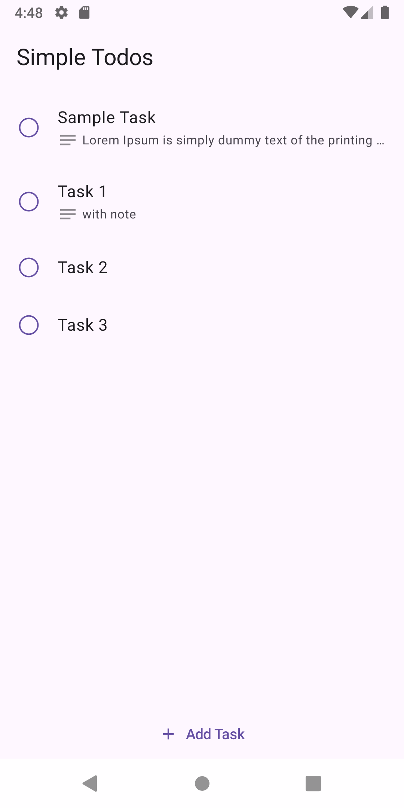
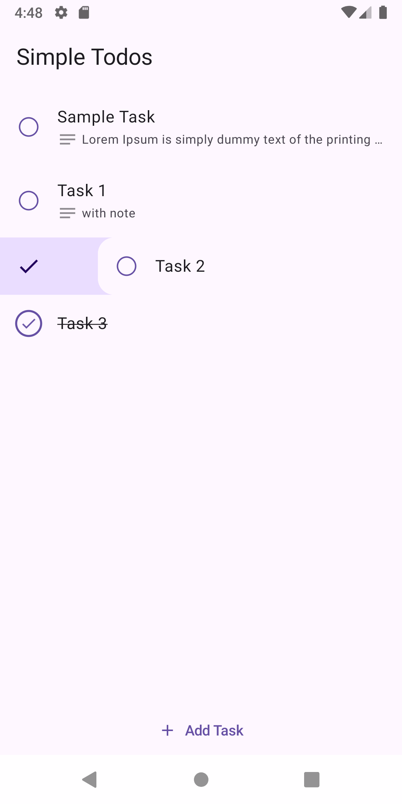
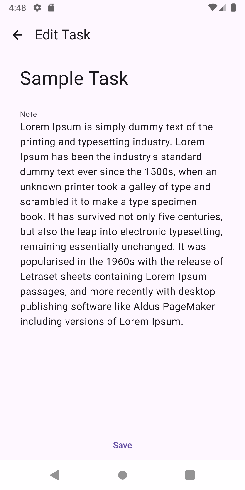

# Simple Todos

An Android native app created for personal practice. This project is designed to explore and implement:

- **Room Database** for local data storage.
- **Jetpack Compose** for modern UI development.
- **Compose Navigation** for managing app screens.
- **MVI Architecture** for state management and unidirectional data flow.

## Features

- Add, edit, and delete tasks.
- Swipe to delete or mark the task as completed.
- Undo task deletion.
- Persist tasks using **Room Database**.
- Navigate between screens using **Compose Navigation**.

## Screenshots

| Screenshot 1 | Screenshot 2 | Screenshot 3 |
|-------------|-------------|-------------|
|  |  |  |

## License

This project is for personal practice and learning purposes. Feel free to fork and modify as needed.

---

### Contributions

This is a personal project, but feedback and suggestions are always welcome!